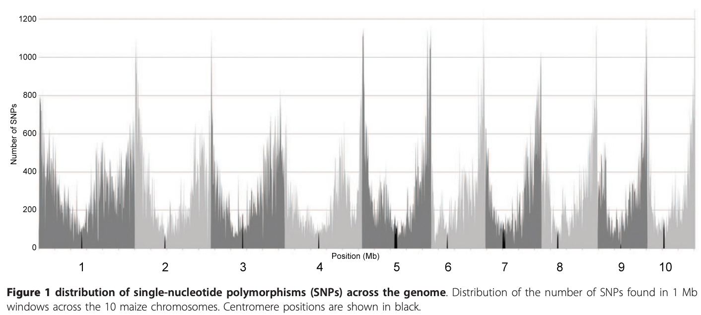
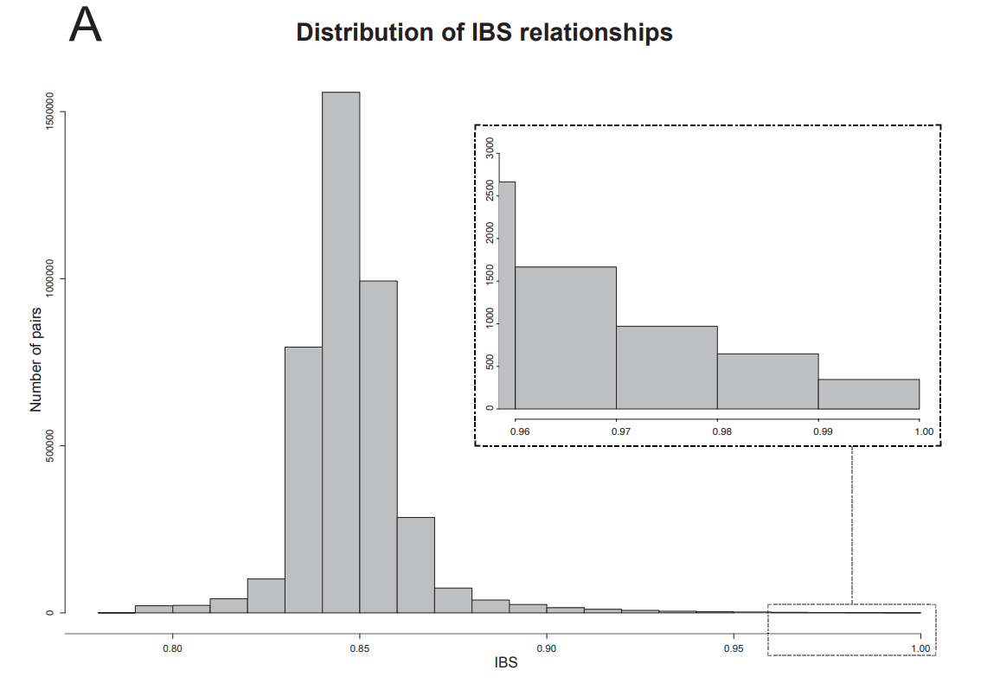
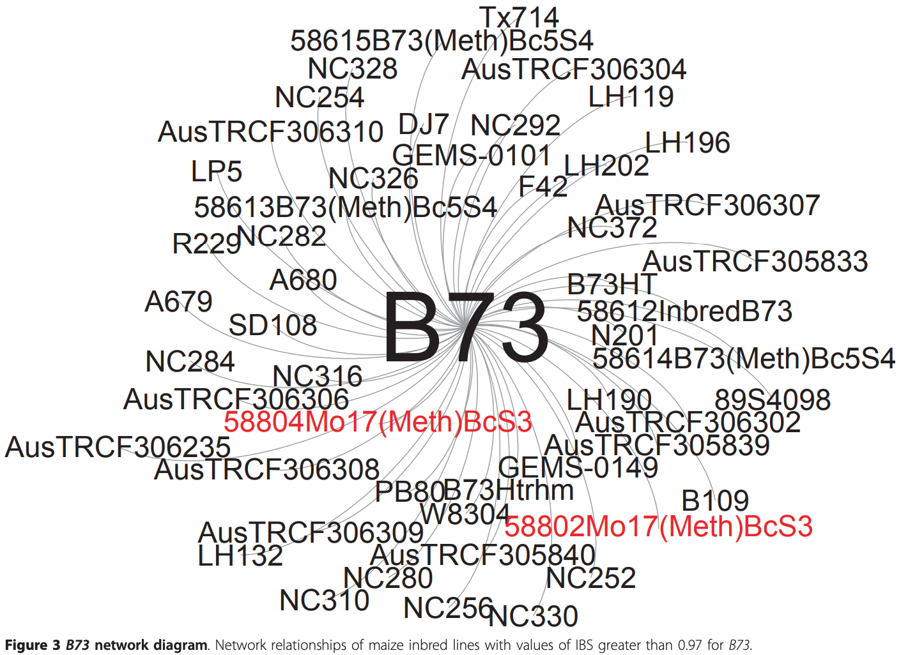
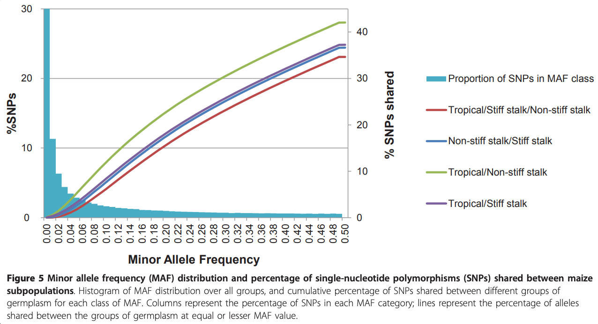
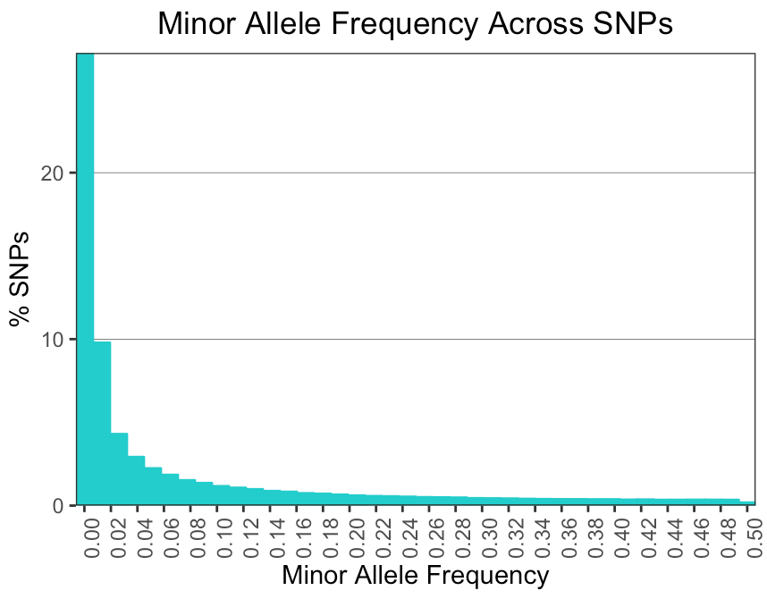

# Replication of "Comprehensive Genotyping of the USA National Maize Inbred Seed Bank" - Romay *et al.* 2013
BCB546x Fall 2018

Analysis and Replication by Iowa Captives: Daniel Kohlhase, Alejandro Ledesma, Anderson Verzegnazzi, Cassie Winn

## Background of paper

This paper was published not long after the development of the then new sequencing procedure, Genotyping by Sequencing (GBS). GBS enables characterization of germplasm collections on a genome-wide scale and can be applied to species with high-diversity and large genomes, such as maize. Plant introduction stations around the world, such as the USDA-ARS North Central Regional Plant Introduction Station (NCRPIS) in Ames, Iowa, preserve distinct inbred lines and curate and manage these germplasm collections. Many studies have been conducted to genotypically characterize such collections, however small sample sizes may not allow the identification of all important or significant QTLs for complex traits. In this study done by Romay *et al.*, GBS was used to analyze 4,351 maize samples from 2,815 maize accessions with 681,257 SNP markers across the genome.

This paper had five objectives:

1. Compare GBS sequencing technology with other available options
2. Explore the potential of GBS to help with curation and use of germplasm
3. Evaluate genetic diversity and population structure both across the genome and between groups of germplasm
4. Investigate the history of recombination and LD through the different breeding groups
5. Explore the potential of the collection as a resource to study the genetic architecture of quantitative traits.

## Replication of Analyses & Results
### Figure 1 - Distribution of SNPs Across the Genome

### Figure 2 - Identical by State Distribution Across GBS Samples

### Figure 3 - B73 Network Diagram

In Figure 3 of the paper, the authors represent a network diagram using the inbred line B73 as reference and the 51 closest related inbred lines with values of IBS ≥ 97 %. The network of relationships obtained using GBS data combined with pedigree information,
provides a powerful tool to identify accessions that may have been misclassified, select best sources for multiplication/distribution, eliminate duplications, select core collections, add or recommend new experimental entries and in theory, to assess genetic profile changes over successive regenerations which could be another quality-assurance measure.

We replicated this analysis and were able to obtain almost the same graph using the same software that they used (Gephi-0.9.2) which is an open source network visualization platform. Additionally we tried to reproduce the same graph using R studio installing the packages “igraph”. To do this we used the graph_from_data_frame() function, which takes two data frames: d and vertices.
-	d describes the edges of the network. 
-	vertices start with a column of node IDs. Any following columns are interpreted as node attributes like Inbred Lines and ibs values.

We generated these two data frames with the information that was provided on additional file 2 (13059_2013_3103_MOESM2_ESM) that can be found in the  /Data/additional_materials folder of this repository. This file contains the distribution of the IBS relationships and the 10 closest neighbors for each unique inbred line. However, since this graph was created using the inbred line B73 and the closest related inbred lines with IBS values ≥ 97 %, we extracted these lines manually using Excel functions and then the file “IBS relationships for B73.csv” was generated and is also provided in the /Data/additional_materials folder of this repository.

Once we created these two files, the data was read into Gephi where we created the figure using the different types of visualization of the software. Additionally we recreated the figure in R studio using the packages “igraph”. As we can see in our Figure, we got very similar results even when the authors do not explain the procedure that they follow, they just showed the name of the software that they used.

### Figure 5 - Minor Allele Frequency Distribution and Percentage of SNPS Shared Between Maize Populations
In Figure 5 of the paper, they show both minor allele frequency distribution across all pairs of lines and the percentage of SNPs shared between maize subpopulations. In the paper they describe that: "MAF were calculated using the ‘Geno Summary by Site’
analysis tool in TASSEL (version 4.0). Taxa and site
filter tools from that program were also used. To remove possible sequencing errors, only alleles detected in at least two individuals in a particular group were considered to be present for the allelic diversity calculations."

We attempted to replicate this analysis and were *partially* successful. We were able to calculate minor allele frequency using TASSEL (version 5.0). The raw imputed genotypic data was uploaded to TASSEL, and using the function 'Geno Summary by Site' we were given MAF for each SNP on each chromosome. This data was then exported as a .csv file from TASSEL and can be found in the /Data/TASSEL folder of this repository. From there, the data was read into R, where we compiled the files into one and used ggplot to graph %SNPs vs Minor Allele Frequency. As can be seen in our graph below, we got very similar results. Unfortunately, however, we were not able to complete the second portion of the graph for multiple reasons. First, it was not made clear in the paper how they calculated the % SNPs shared between subgroups at specific minor allele frequencies. We thought they might have done it using TASSEL and the 'Geno Summary by Taxa' function, however this only provides the proportion of SNPs that are heterozygous and proportion missing for each line. Additionally, the only file the author's provided that had the subgroups listed is Additional file 1. Had we determined how to calculate % SNPs shared at a specific minor allele frequency, we would then need to match each inbred line to their corresponding subgroups. Lastly, this data is very large with 681,257 SNPs across 10 chromosomes and 2,815 accessions so comparing the % of SNPs shared is computationally difficult.

### Genome-Wide Association Studies

